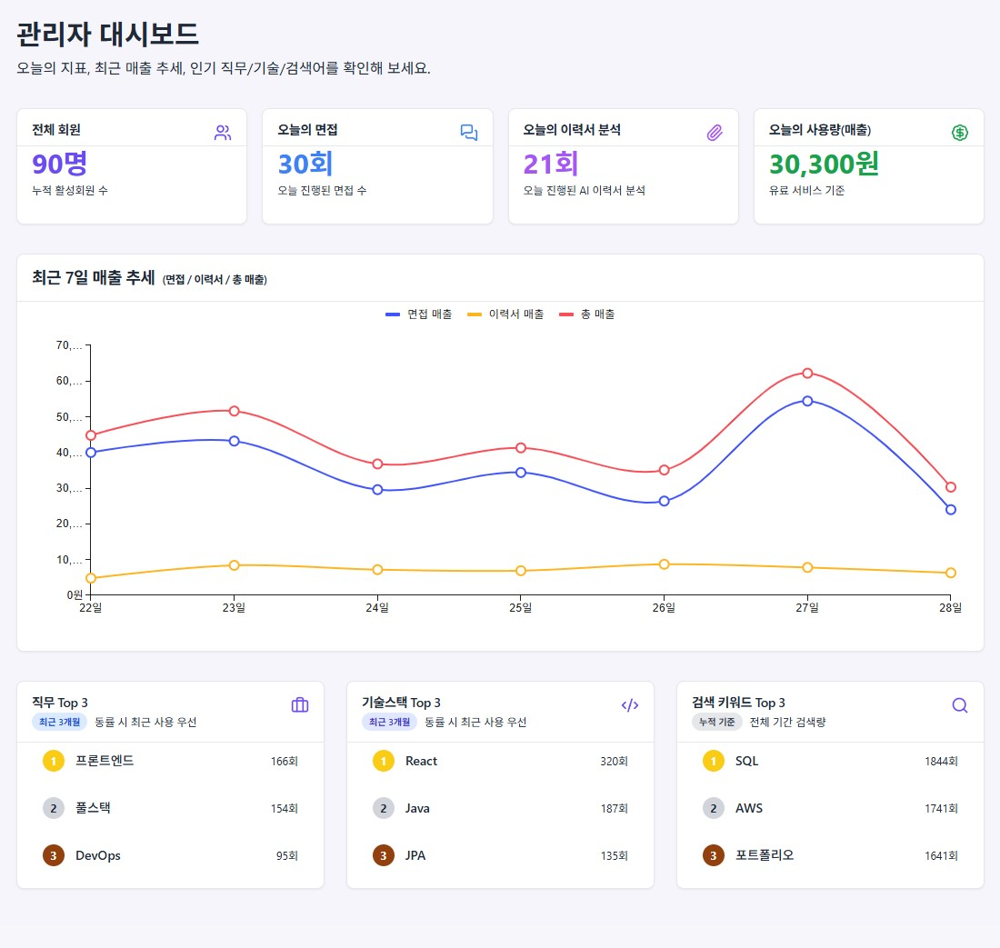
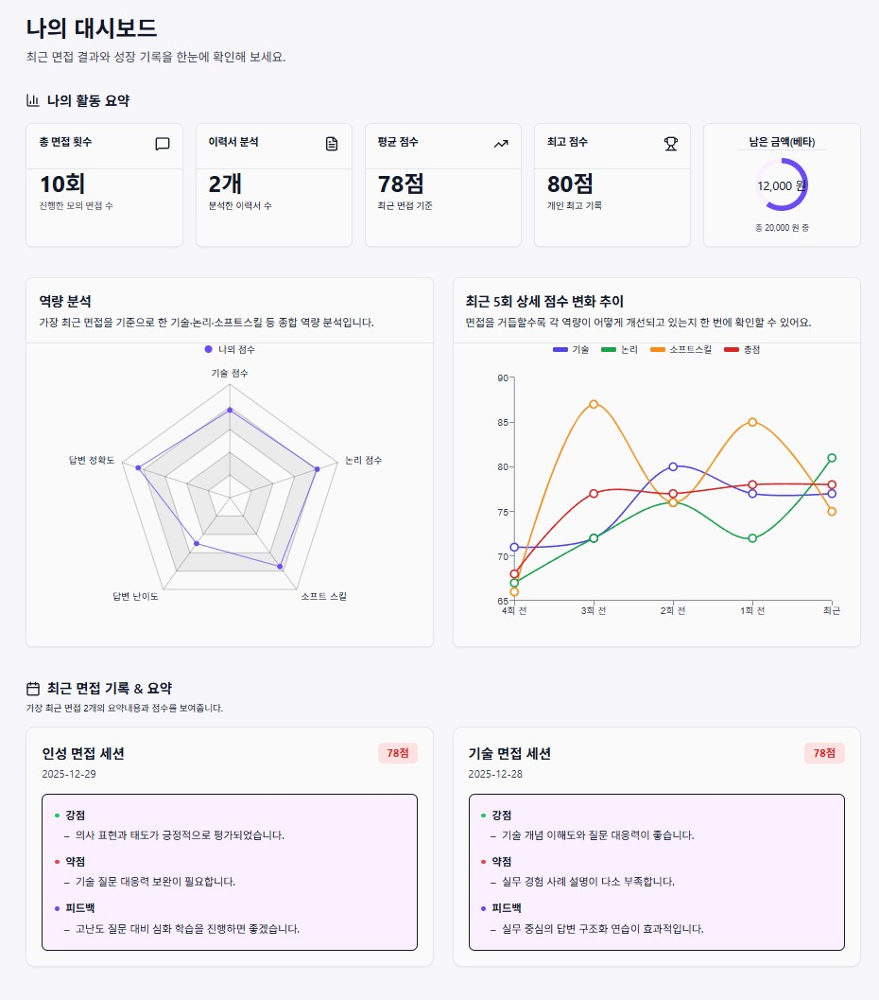
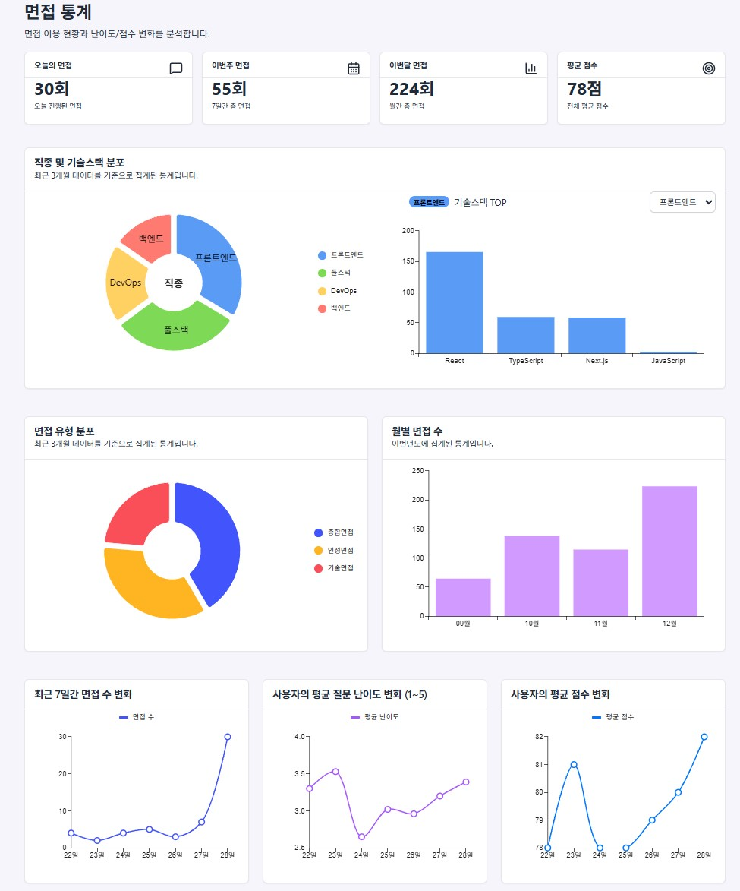
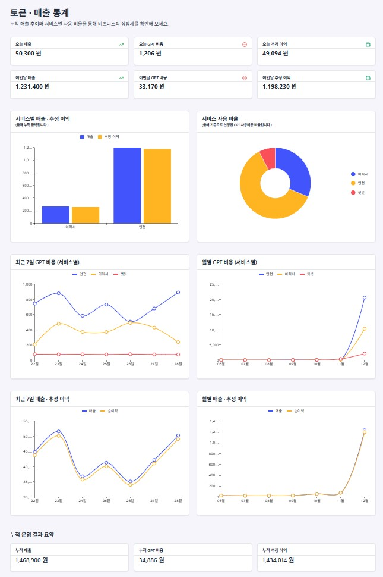
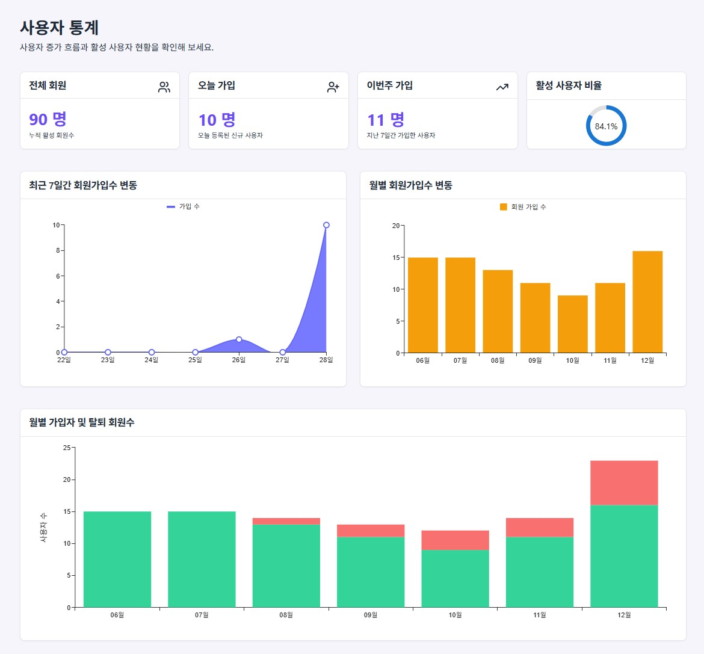

<h1 align="center">AI Interview Service</h1>

  <b>Dashboard-Oriented Full-Stack Project</b> 
  사용자 성장과 서비스 운영 지표를 함께 고려한 AI 모의면접 서비스

---

## 📌 Project Overview

AI 기반 모의 면접 및 이력서 분석 웹 서비스입니다.

본 프로젝트는 단순 결과 제공이 아닌,  
**사용자는 자신의 성장 흐름을 확인하고**,  
**관리자는 서비스 운영 상태를 빠르게 판단할 수 있도록**  
대시보드 중심 구조로 설계되었습니다.

---

## 🚀 Core Features

### 👤 User
- AI 모의 면접 및 이력서 분석 결과 확인
- 사용자 대시보드
  - 누적 이용 횟수
  - 평균 / 최고 점수
  - 역량별 점수 변화 추이 시각화
  - 최근 면접 기록 요약

### 🛠 Admin
- 관리자 대시보드
  - 오늘의 사용자 / 면접 / 매출 KPI
  - 최근 이용 및 매출 추이
- 통계 대시보드
  - 면접 / 사용자 / 매출 · 토큰 통계
- 회원 관리 (검색 / 정지 / 복구)

---

## ⭐ My Role (Frontend Focus)

본 프로젝트에서 **대시보드 중심 화면 설계와 인증 구조 구현을 전담**했습니다.
README는 프론트엔드 관점의 설계 및 구현 내용을 중심으로 정리했습니다.

- 사용자 / 관리자 / 통계 **대시보드 전담 설계 및 구현**
- 백엔드 집계 데이터를 기반으로 한 **차트 중심 UI 구성**
- Zustand 기반 **전역 인증 상태 관리**
- Protected Route를 활용한
  - 비회원 / 회원 / 관리자 **권한별 접근 제어**
- 관리자 회원 관리 화면 구현 (검색 / 상태 변경)

---

## 🔐 Authentication & Authorization

- JWT 기반 인증 구조
- 전역 Auth State (Zustand)
- 페이지 새로고침 시 인증 상태 복구
- URL 직접 접근 시 권한별 라우팅 차단(protected route)

---

## 🧠 Design Philosophy

- 사용자가 **스스로 실력 변화를 인지**할 수 있는 UX
- 관리자가 **빠르게 운영 판단**을 할 수 있는 정보 구조
- 단순 수치가 아닌 **의사결정 가능한 데이터 시각화**

---

## 🛠 Tech Stack (Frontend)

| Category | Stack |
|--------|------|
| Framework | React, React Router |
| State | Zustand |
| UI | MUI, MUI Charts |
| Network | Axios |
| Auth | JWT |
| Infra | AWS EC2, Docker, Nginx |
| CI/CD | GitHub Actions |

---
## 🖼 Screenshots

### 🔐 Admin Dashboard
서비스 운영 상태와 주요 KPI를 한눈에 확인할 수 있는 관리자 대시보드

---

### 👤 User Dashboard
사용자가 면접을 반복하며 실제로 성장하고 있는지를 판단할 수 있도록 설계한 대시보드

---

### 📊 Interview Statistics
면접 유형, 직군, 기술 스택 분포를 기반으로 한 서비스 사용 통계

---

### 💰 Token & Revenue Statistics
GPT 사용 비용을 실제 비즈니스 지표로 환산한 매출·비용 통계 대시보드

---

### 👥 User Statistics (Service Health Metrics)

서비스 전체의 성장성과 활성 상태를 판단하기 위한 사용자 통계 대시보드  
(가입 추이 · 활성 사용자 비율 · 활동 흐름 시각화)
